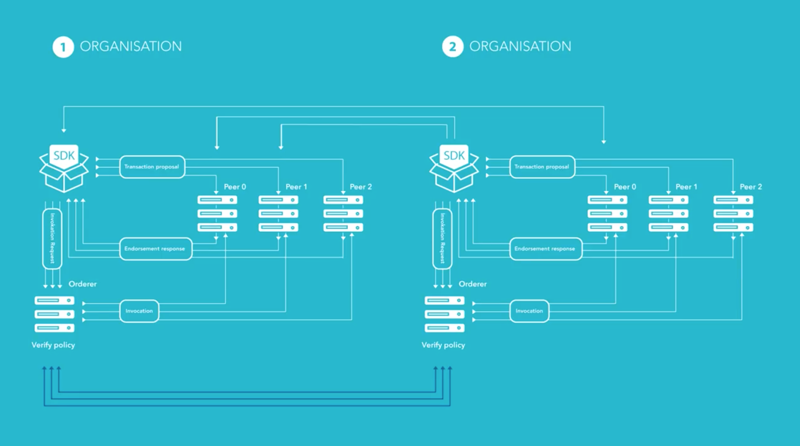

# 1. What is Hyperledger Fabric?

> Problem it solves: How to enforce trust between parties that don't trust each other?
> > One liner: Hyperledger fabric is enterprise grade distributed ledger based on blockchain technology that use smart contracts to enforce trust between parties.

- IBM: Creted Hyperledger and made it open source
- The Lunix Fundation: Govern the open soure project (yayyy!)
- Hyperledger fabric is one of the project of Hyperledger. See the other project under the umberella on hyperledger's website.

# 2. How Hyperledger reinforces truth and trust?

- Hyperledger is blockchain but not cryptocurrency: No mining
- Use different consensus algorithm that do not need mining
	- Block immutabiluty
	- Order of operation determinism
	- Prevention of double spending
- Better throughput of the system
- Distributed by design
- Ledger records transactions happening on the network inside a channel: Serious audit of the data is possible
- Blockchain define the order of operations
	- World state: same current state between peers
	- History: Can be replayed on each peer and will lead to the world state

# 3. How hyperledger solves prooblems?

Let two entities that do not trust each other want to collaborate:

1. Each entity keeps record of everything that happens with its own data, software, data center. Problem: It is unlikely that the world state will match in the end between the two
1. The entities find a thirdparty that they both trust. Problem: Hard to find, cost money, what if the thirdparty makes a mistake?

> Solution: Hyperledger with smart contracts that enforce the business process between the parties. Each participant has the complete record. Smart contract will say of the operation is permitted or prohibited.

# 4. Main three components of hyperledger fabric

## Fabric CA

[readthedoc](hyperledger-fabric-ca.readthedocs.io)

> Tool that allows to generate certificate (per user)

- Every operation on the ledger has to be signed by the certificate
- Certificate as X.509 standard
- Possible to generate with open SSL or ask a thirdparty
- Inside the certificate we can put attributes (additional info for the business logic). The chaincode can read the attributes and behave accordingly
- Generate the certificates for a participant = enroll the particiapant
- fabric can be attached to active directory
- With the certificate, we can track what a user does on the blockchain

**Workflow**: Register user > Give attributes > Make enrollement certificate > provide the certificate to the SDK > The SDK use the certificate to sign transactions.

## Fabric peer

- Place where the ledger is stored
- If prod, need more than 1 peer
- Requests from the SDK are send to the peer
- One peer can be part of many channels
- Channels are isolated inside a peer
- Peer updates the ledger
- Backup blockchain = backup peer
- Each peer discover the other themselves automatically

## Fabric orderer

- Ordering service = heart of consensus
- Main role: Provide order of operation
- Before anything is commited to the blockchain, it musts passes through the ordering service
- The orderer is responsible for making the blocks of the blockchains
- Transactions inside the block are in a particular order
- Once the block is full, orderer sends the block to the peers

- Solo orderer = only for dev and tests
- In production, use apache kafka for example (distribute the ordering service is essential).
	- The switch between the two is transparent for the dev

# 5. Channels, the fundamental concept inside of Hyperledger composer

- Specific to Hyperledger

> Separate instance of Hyperledger Fabric. Each channel is indepependant. They don't exchange data.

- Parties A, B and C. If A and B have a channel between them, C doen not even see it.
- Each peer has to be part of a channel at least
- Once the peer is created it has to join a channel
- All parties have to agree
- Also possible to had a group to a channel
- Create a channel with `configtx`

# 6. What is chaincode

See [the chaincode folder: ../Chaincode/](../Chaincode/)

# 7. How exactely fabric works - basic workflow of transaction endorsement

1. SDK sends transaction proposal to one or multiple peers
1. Peers verify the transaction and sign it
1. Send back to the SDK as an endorsement response
1. SDK invoked the orderer accordingly to the endorsement policy
	- Orderer does not update the ledger
	- Still, the orderer prepare the transaction so we can have an audit
1. Orderer also verifies the read/write set for each endorsement response. **they must be the same**.
	- If mismatch (a peer is compromised for example), the orderer will not update the ledger
	- Will be possible to audit and find the peer that raises the problem
1. If Ok, orderer orders the peers to update the ledger: Invocation step. Each peer will have the same world state.

- Each org has to have its own ordering service

# 8. MSP implementation supported by Hyperledger fabric

- MSP = Membership Service Providers
- How you define organisations and networks: set of crypto materials
- The orderer itself need certificates (different from the client cert).
- Say a peer, an orderer is part of the org
- Only peers of the same MSP can see each other: Gossip protocol
- MSP id = String related to a set of certificates. Use a name that makes sens to you. A MSP id defines who you are
